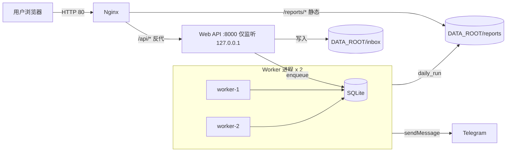

# 云端 MVP（阿里云 / 公网 IP / Nginx + Web Upload + Worker Queue）设计稿

## 1. 目标与范围

### 1.1 目标

在阿里云单台主机（公网 IP，无域名）上提供：

- Web 上传入口：上传一对 `stock/etf` xlsx（同一 `snapshot_date`）
- 队列执行：上传后入队，2 个 Worker 并发抢占执行 daily run
- 报告对外访问：报告落在同机磁盘，由 Nginx 通过 `/reports/` 暴露公网访问链接
- 通知闭环：Telegram 收到简版清单 + `summary.md` 链接 + reports 目录链接

### 1.2 非目标（MVP 不做）

- 域名与 HTTPS（后续可补，MVP 先用公网 IP + HTTP 80）
- 完整 Web 前端页面（先做 HTTP API）
- 对象存储（OSS/S3/R2）（后续扩展，MVP 同机磁盘）
- 多租户与复杂权限体系（MVP 仅个人使用的最小鉴权）

## 2. 关键约束与已确认决策

- 云厂商：阿里云 ECS
- 访问方式：公网 IP（无域名）
- 端口策略：对外开放 80（HTTP）
- Nginx：
  - `/reports/` 静态暴露（可公开）
  - `/api/` 反代到 Web 服务（强制 Bearer Token）
- 鉴权策略：`/api/*` 必须带 `Authorization: Bearer <API_TOKEN>`
- Worker 并发：2
- 存储：同机磁盘 `DATA_ROOT`（含 `inbox/` 与 `reports/`）

## 3. 总体架构

### 3.1 组件关系



### 3.2 数据流（上传 → 执行 → 浏览）

1) 用户调用 `POST /api/upload` 上传两份文件（stock/etf）。  
2) Web API 校验命名契约与日期一致性，保存到 `DATA_ROOT/inbox/{upload_id}/...`。  
3) Web API 在 SQLite 写入 `runs`、`file_batches`，并插入一条 `jobs`（PENDING）。  
4) Worker 从 `jobs` 原子抢占一条 job，获取 `snapshot_date` 互斥锁后执行 daily_run。  
5) daily_run 生成 `summary.md` 与 provider 报告写入 `DATA_ROOT/reports/{snapshot_date}/{run_id}/`。  
6) Worker 发送 Telegram：简版结果 + `summary_url` + `reports_url`。  
7) 用户在 TG 点开 `http://<公网IP>/reports/...` 查看报告。

## 4. 对外 URL 规范（无域名）

### 4.1 reports 链接（TG 与浏览器访问）

- reports 目录：
  - `http://<公网IP>/reports/{snapshot_date}/{run_id}/`
- 汇总文件：
  - `http://<公网IP>/reports/{snapshot_date}/{run_id}/summary.md`

### 4.2 API 链接（必须 Bearer Token）

- `http://<公网IP>/api/upload`
- `http://<公网IP>/api/runs`
- `http://<公网IP>/api/runs/{run_id}`

## 5. 存储布局（同机磁盘）

建议云端固定：

- `DATA_ROOT=/var/lib/multi-agent-investment`

目录约定：

```text
DATA_ROOT/
  inbox/
    {upload_id}/
      {snapshot_date}_stock.xlsx
      {snapshot_date}_etf.xlsx
  reports/
    {snapshot_date}/
      {run_id}/
        summary.md
        stock_{provider}.md
        etf_{provider}.md
  app.sqlite   （SQLite 数据库文件，具体路径由现有配置决定）
```

## 6. Web API 设计

### 6.1 框架选择（MVP）

仓库当前未提供依赖锁定文件，MVP 优先选择 Python 标准库实现最小 HTTP 服务：

- `http.server` + `cgi.FieldStorage` 解析 multipart 上传

后续需要 OpenAPI/更强上传/中间件体系时，迁移到 FastAPI/Starlette。

### 6.2 鉴权（Bearer Token）

对所有 `/api/*` 请求：

- 必须存在 Header：`Authorization: Bearer <API_TOKEN>`
- 不通过则返回 `401`（不暴露更多信息）

### 6.3 `POST /api/upload`

**请求**

- Header：`Authorization: Bearer <API_TOKEN>`
- Content-Type：`multipart/form-data`
- 表单字段：
  - `stock_file`：文件名必须匹配 `YYYY-MM-DD_stock.xlsx`
  - `etf_file`：文件名必须匹配 `YYYY-MM-DD_etf.xlsx`

**校验**

- 两个文件都必须存在
- 文件名必须匹配命名契约
- 两个文件解析出的 `snapshot_date` 必须一致

**处理**

1) 生成：
   - `upload_id`（用于落盘目录）
   - `run_id`（用于 runs 追踪）
2) 落盘到 `DATA_ROOT/inbox/{upload_id}/...`
3) SQLite 写入：
   - `runs`：`RUNNING`
   - `file_batches`：记录 stock_path/etf_path（或等价字段）
   - `jobs`：入队 `PENDING`
4) 返回 JSON：包含 `run_id/snapshot_date/job_id/reports_url/summary_url`

**响应（示例）**

```json
{
  "run_id": "run-xxxxxxxx",
  "snapshot_date": "2026-04-17",
  "job_id": "job-xxxxxxxx",
  "reports_url": "http://<公网IP>/reports/2026-04-17/run-xxxxxxxx/",
  "summary_url": "http://<公网IP>/reports/2026-04-17/run-xxxxxxxx/summary.md"
}
```

### 6.4 `GET /api/runs`

返回最近 N 条 run：

- `run_id`
- `snapshot_date`
- `status`（RUNNING/SUCCEEDED/DEGRADED/FAILED）
- `started_at`、`ended_at`
- `reports_url`、`summary_url`

### 6.5 `GET /api/runs/{run_id}`

返回单次 run 详情：

- run 状态、时间
- decisions（stock/etf）
- notifications 状态与错误信息
- provider 报告列表（llm_reports）
- `reports_url`、`summary_url`

## 7. SQLite 扩展（Job Queue + Snapshot Lock）

### 7.1 新增表：`jobs`

建议字段（与实现计划一致，可微调命名）：

- `job_id TEXT PRIMARY KEY`
- `run_id TEXT NOT NULL`
- `snapshot_date TEXT NOT NULL`
- `status TEXT NOT NULL`（PENDING/RUNNING/DONE/FAILED）
- `attempts INTEGER NOT NULL DEFAULT 0`
- `locked_by TEXT NULL`
- `locked_at TEXT NULL`
- `last_error TEXT NULL`
- `created_at TEXT NOT NULL DEFAULT CURRENT_TIMESTAMP`

关键约束/索引建议：

- `INDEX jobs_status_created_at(status, created_at)`：按状态取队首
- `INDEX jobs_snapshot_date(snapshot_date)`：按日期排查

### 7.2 新增表：`snapshot_locks`

用于保证同一 `snapshot_date` 只允许一个 Worker 执行：

- `snapshot_date TEXT PRIMARY KEY`
- `locked_by TEXT NOT NULL`
- `locked_at TEXT NOT NULL`

### 7.3 Claim 语义（原子抢占）

`claim_next(worker_id)` 需要满足：

- 同一个 `job_id` 不会被两个 worker 同时 claim
- claim 成功时写入 `locked_by/locked_at`，并将 `status` 从 PENDING → RUNNING

可行策略（SQLite）：

- 使用 `BEGIN IMMEDIATE` 开事务
- 先 SELECT 一条 PENDING 的 job_id
- 再 UPDATE 该行并用条件约束（`status='PENDING' AND locked_by IS NULL`）确保原子性
- UPDATE 影响行数为 1 才算 claim 成功

### 7.4 snapshot_date 互斥语义

Worker 在真正执行 daily_run 前：

- 尝试 `INSERT INTO snapshot_locks(snapshot_date, locked_by, locked_at) VALUES (...)`
- 若冲突（主键已存在）则认为该日期已有任务在跑：
  - 将 job 释放回 PENDING（或延迟重试）
  - 避免重复推送、重复写报告

执行结束后：

- `DELETE FROM snapshot_locks WHERE snapshot_date = ? AND locked_by = ?`

## 8. Worker 设计（并发 = 2）

### 8.1 进程模型

- 2 个独立进程（推荐 systemd：`worker@1`、`worker@2`）
- 每个进程有稳定 `worker_id`，用于 jobs/snapshot_locks 记录

### 8.2 主循环（伪代码）

```text
loop:
  job = claim_next(worker_id)
  if job is None:
    sleep(poll_interval)
    continue

  if not acquire_snapshot_lock(job.snapshot_date):
    release_job_back_to_pending(job)
    sleep(short_backoff)
    continue

  try:
    daily_run(run_id=job.run_id, file_paths=from_file_batches)
    mark_job_done(job)
  except Exception as e:
    mark_job_failed(job, e)
  finally:
    release_snapshot_lock(job.snapshot_date, worker_id)
```

### 8.3 与现有 orchestrator 的衔接点

核心要求：daily_run 必须支持“指定文件路径”作为输入（来自 `file_batches`），避免依赖扫描目录与固定文件名，从而支持并发与隔离。

## 9. Nginx 约定（MVP）

### 9.1 监听与反代

- 监听：80
- `/api/` → 反代 `http://127.0.0.1:8000`
- `/reports/` → 静态目录映射到 `${DATA_ROOT}/reports/`

### 9.2 可观测性与最小安全建议

- `/api/` 记录访问日志（包含 run_id 相关字段可选）
- `/reports/` 可开目录索引（MVP 方便排查），后续可关闭并只暴露 summary/固定文件

## 10. 配置项（env）

新增（云端相关）：

- `PUBLIC_BASE_URL="http://<公网IP>"`
- `REPORTS_PUBLIC_PATH="/reports"`
- `WEB_BIND_HOST="127.0.0.1"`
- `WEB_PORT="8000"`
- `API_TOKEN="..."`（务必随机强密码）
- `WORKER_CONCURRENCY="2"`（或改用 systemd 实例数量表达）
- `DATA_ROOT="/var/lib/multi-agent-investment"`

保留现有：

- `TELEGRAM_BOT_TOKEN`、`TELEGRAM_CHAT_ID`、`DRY_RUN`
- `LLM_ENABLED_PROVIDERS` 与各 provider 的 `*_API_KEY/_MODEL/_BASE_URL` 等

## 11. 错误处理策略

- 上传契约失败（缺文件/命名不合规/日期不一致）：直接 `400`，返回可读错误信息（不包含敏感信息）
- 鉴权失败：`401`
- Job 执行失败：
  - `jobs.status=FAILED`，记录 `last_error`，`attempts += 1`
  - 是否重试：由 `max_attempts` 控制（MVP 建议 2~3）
- Telegram 发送失败：不应导致 runs=FAILED（保持现有“通知失败不致命”的策略），但要落库可审计

## 12. 安全注意事项（必须执行）

- 任何 Token/API Key 严禁提交到 git；`.env.local` 必须在 `.gitignore` 中
- Telegram Bot Token 一旦泄露必须立刻重置并作废旧 token
- `API_TOKEN` 必须长且随机；并限制仅用于 `/api`（不要复用其他系统密码）

## 13. 里程碑与验收标准

### 13.1 MVP 验收（功能）

- 能上传一对 xlsx → 返回 `run_id` 与 `summary_url`
- Worker 自动执行并生成：
  - `DATA_ROOT/reports/{snapshot_date}/{run_id}/summary.md`
  - provider 报告 md（至少一份）
- Telegram 收到：
  - 简版清单
  - `summary_url` 可点击打开

### 13.2 MVP 验收（并发与互斥）

- 同时启动 2 个 worker：
  - 不会重复 claim 同一个 job
  - 同一 `snapshot_date` 不会并行执行两次（snapshot_locks 生效）

